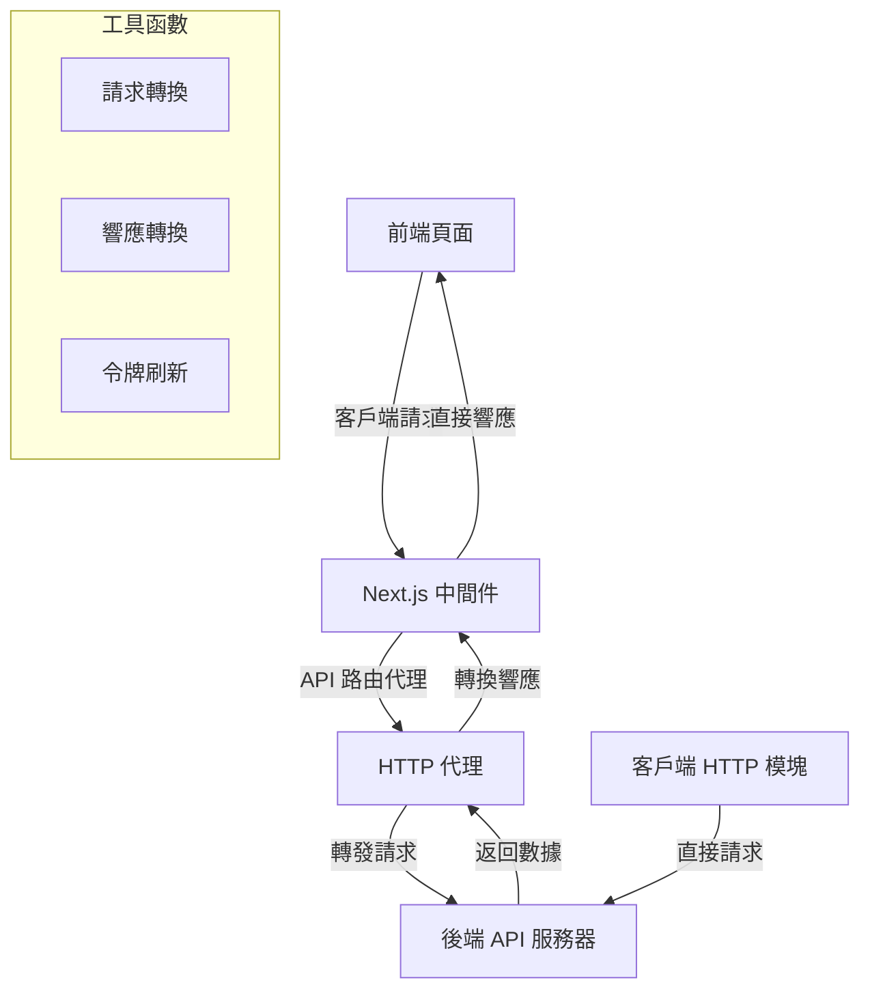
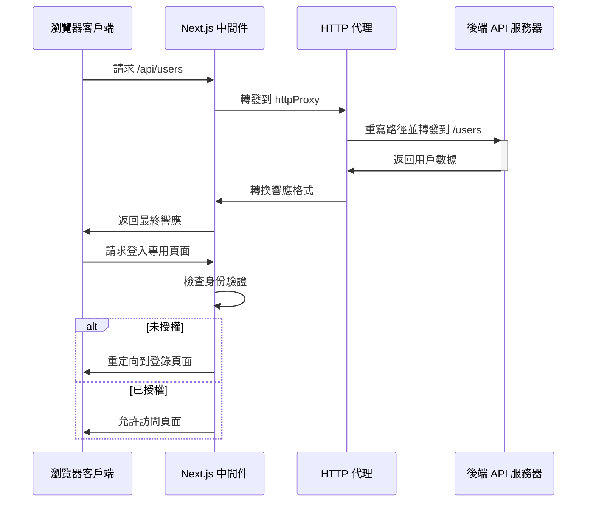
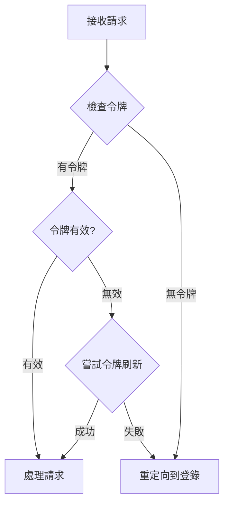
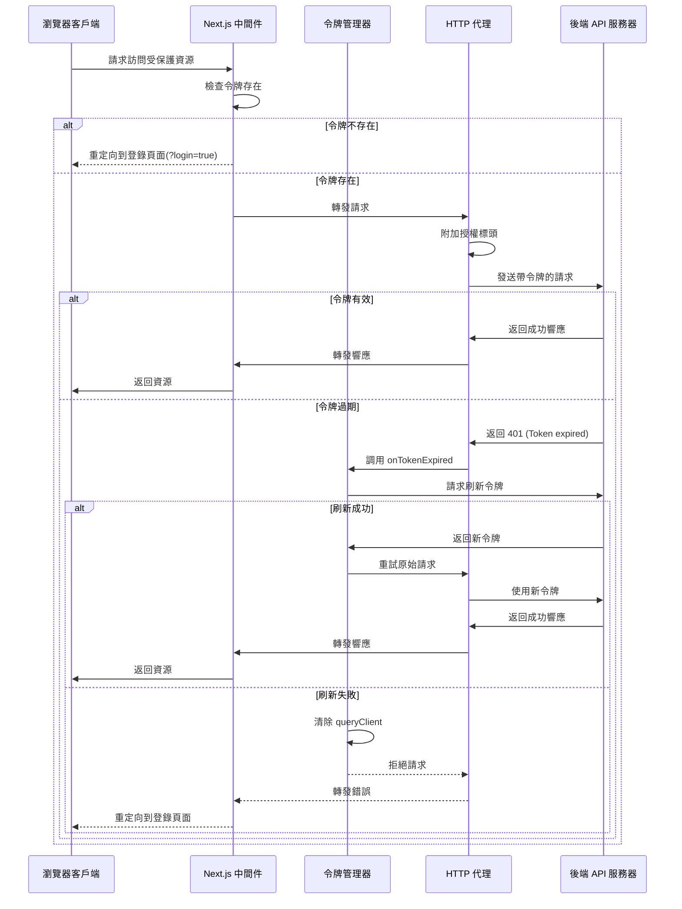
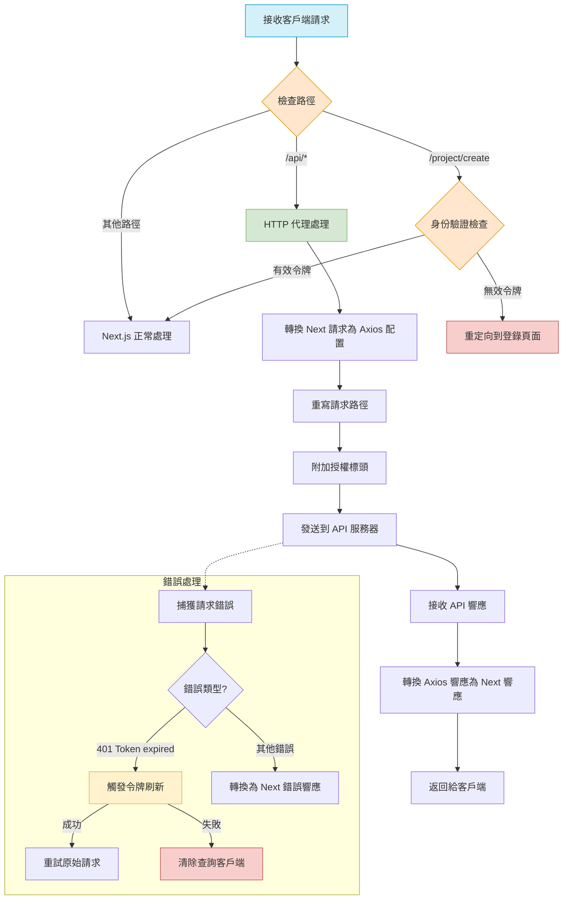

# API 通信機制文檔

## 系統架構概述

該系統實現了一個現代化的前後端分離應用程序的 API 通信架構，基於 Next.js 框架。系統主要包括以下幾個核心組件：

1. **中間件 (Middleware)** - 處理 API 路由和身份驗證
2. **HTTP 客戶端** - 處理前端到 API 服務器的請求
3. **HTTP 代理** - 用於在服務器端轉發請求
4. **公共工具函數** - 提供各種 HTTP 請求和響應轉換功能

下面是系統架構的高層概述：



## 核心功能模塊詳解

### 1. 中間件 (middleware.ts)

中間件是系統的入口點，負責處理所有傳入請求的初步處理和路由。

**主要功能**：

- API 路由代理：將 `/api/*` 路徑下的請求轉發到後端 API 服務器

```javascript
// 簡化示例
export async function middleware(request: NextRequest) {
  // API 代理
  if (/^\/api\/(.*)/.test(pathname)) {
    return await httpProxy(request, {
      rewrite: (req) => ({
        target: API_SERVER_URL,
        changeOrigin: true,
        path: req.nextUrl.pathname.replace(/^\/api/, '')
      }),
    })
  }
  return NextResponse.next();
}
```

### 2. HTTP 客戶端 (client.ts)

客戶端模塊提供了用於前端發送 API 請求的工具函數和配置。

**主要功能**：

- `createClientAxios`: 創建和配置 Axios 實例
- `http`: 創建具有請求和響應模式驗證功能的 HTTP 客戶端
- `contract`: 初始化 API 合約，用於類型安全的 API 調用

**特點**：

- 支持 Zod 模式驗證
- 自動處理身份驗證令牌
- 開發環境下的請求/響應驗證

```javascript
// 使用示例
const apiClient = http({
  requestSchema: z.object({ name: z.string() }),
  responseSchema: z.object({ id: z.number(), name: z.string() })
});

const response = await apiClient.request({
  method: 'POST',
  url: '/users',
  data: { name: 'John' }
});
```

### 3. HTTP 代理 (server.ts)

服務器端 HTTP 代理負責在 Next.js 服務器端轉發請求到後端 API 服務器。

**主要功能**：

- `createServerAxios`: 創建服務器端 Axios 實例
- `httpProxy`: 處理請求代理並轉換響應
- 錯誤處理和令牌過期處理

```javascript
// 使用示例
export async function GET(req: NextRequest) {
  return httpProxy(req, {
    rewrite: (req) => ({
      target: 'https://api-server.com',
      path: '/users'
    })
  });
}
```

### 4. 公共工具函數 (common.ts)

提供各種工具函數，用於請求和響應的轉換。

**主要功能**：

- `nextRequestToAxiosRequestConfig`: 將 Next.js 請求轉換為 Axios 配置
- `axiosResponseToNextResponse`: 將 Axios 響應轉換為 Next.js 響應
- `flattenAxiosConfigHeaders`: 處理 Axios 頭部扁平化
- `getReferer`: 獲取請求來源

## 數據流程圖

以下圖表展示了系統中的數據流動：



## 身份驗證機制

系統實現了多層次的身份驗證機制：

1. **Cookie 和 Header 令牌提取**:
   - 從 HTTP 頭部或 Cookie 中獲取 `access_token`
   - 自動將令牌添加到傳出請求中

2. **令牌過期處理**:
   - 檢測 401 錯誤和令牌過期消息
   - 觸發令牌刷新流程
   - 清除 query client 緩存（如果刷新失敗）

3. **路由保護**:
   - 中間件檢查特定路由的身份驗證
   - 未授權用戶重定向到登錄頁面



## 使用案例

### 1. 客戶端 API 調用

```javascript
// 在前端組件中
import { http } from '@/shared/http';

async function fetchUsers() {
  const response = await http().request({
    method: 'GET',
    url: '/api/users',
  });
  return response.data;
}
```

### 2. 創建 API 路由處理程序

```javascript
// app/api/example/route.ts
import { NextRequest } from 'next/server';
import { httpProxy } from '@/libs/http/server';

export async function GET(req: NextRequest) {
  return httpProxy(req, {
    rewrite: (req) => ({
      target: process.env.API_SERVER_URL,
      changeOrigin: true,
      path: '/example-endpoint'
    }),
  });
}
```

### 3. 直接在 Next.js API 路由中使用

```javascript
// app/api/data/route.ts
import { NextRequest, NextResponse } from 'next/server';
import { nextRequestToAxiosRequestConfig, axiosResponseToNextResponse } from '@/libs/http/common';
import axios from 'axios';

export async function POST(req: NextRequest) {
  const config = await nextRequestToAxiosRequestConfig(req);
  config.url = 'https://api.example.com/data';
  
  try {
    const response = await axios.request(config);
    return axiosResponseToNextResponse(response);
  } catch (error) {
    return NextResponse.json({ error: 'Failed to fetch data' }, { status: 500 });
  }
}
```

## 最佳實踐與建議

1. **使用類型安全的 API 客戶端**:
   - 利用 Zod 模式進行請求和響應驗證
   - 在開發環境中啟用驗證，捕獲潛在問題

2. **正確處理身份驗證**:
   - 確保敏感路由在中間件中受到保護
   - 實現適當的令牌刷新邏輯

3. **管理錯誤處理**:
   - 適當處理 API 錯誤
   - 為用戶提供有意義的錯誤消息

4. **優化性能**:
   - 使用查詢客戶端進行緩存
   - 避免不必要的代理轉發

## 配置選項

系統的行為可以通過多種配置選項進行調整：

- **API_SERVER_URL**: 後端 API 服務器的基本 URL
- **IS_DEV**: 控制開發環境特定功能，如模式驗證
- **IS_SERVER**: 區分服務器端和客戶端代碼路徑




